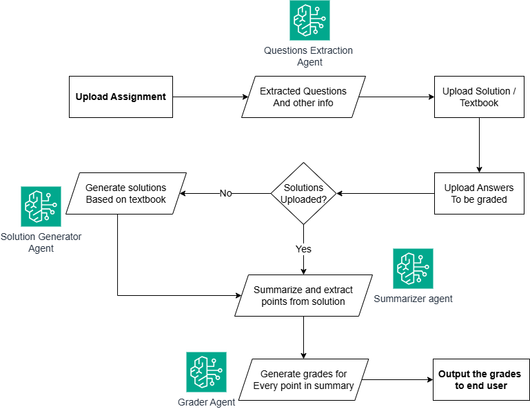

# Grader BOT
Grader bot : A GenAI project for helping teachers with the grading of assignments. It is based on an agentic framework created in Langchain and uses LLM model gpt-4o.

## How Grader BOT works
Grader BOT is built using different agents configured to perform specific tasks, which are configured in  ```/util/agents.py```. Below is the data flow diagram to explain the execution:



## Code Structure
- /pages: All the UI pages for each step of the execution.
- /util: Utility python files written to create agents and perform operations like OCR.
- /home.py: Landing page of the application
- /data: This is a directory which should be created once you start using the application. This is a directory used as local storage for your documents.

## Installation
1. Create a venv: 
```python -m venv path-to-venv```
venv stands for Virtual Environment.
2. Activate the venv:
```source path-to-venv/bin/activate```
3. Install requirements.txt:
```pip install -r requirements.txt```
4. Setup environment variable:
You need to have a valid API key for openai to run this code. Put the key as ```OPENAI_API_KEY = <your-api-key>``` in a file named: ```.env``` in the root folder.

## Running Grader BOT
After completing the setup given above, run this command to start the application: ```streamlit run home.py```.

After running this script, you will be redirected to the application; if not, try accessing ```localhost:8501``` on your browser.
